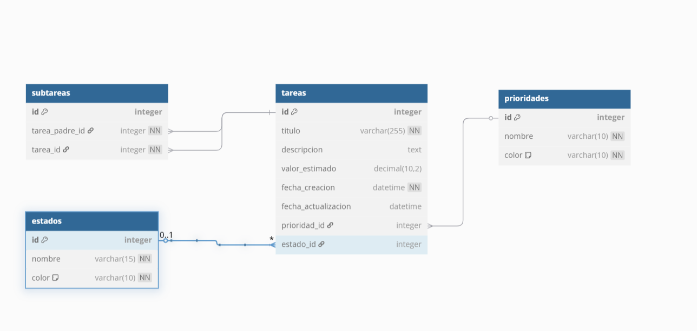

📝 Task System

Sistema de gestión de tareas con frontend en React + Vite y backend en Node.js con SQLite .
<pre>
📦 Estructura del Proyecto

task-system/
├── backend/            
│   └── /package.json
│   └── /package-lock.json
│   └── /eslint.config.js
│   └── database/
│       └── tasks.sqlite
│   └── src/
│       └── server.js
│       └── db.js
│       └── app.js
│       └── Models
│           └── index.js
│           └── priority.js
│           └── state.js
│           └── subtask.js
│           └── task.js
│           └── task_detail.js
│       └── Routes
│           └── priorityRoutes.js
│           └── stateRoutes.js
│           └── taskRoutes.js
│       └── Test
│           └── jest.config.js
│           └── priority.test.js
│           └── state.test.js
│           └── task.test.js
├── frontend/            
│   └── src/
│       └── api
│           └── priority.js
│           └── state.js
│           └── subtask.js
│           └── task.js
│       └── components
│           └── confirmation_dialog.jsx
│           └── task_details.jsx
│           └── task_form.jsx
│           └── task_item.jsx
│           └── task_list.jsx
│       └── pages
│           └── dashboard.jsx
│           └── task_view.jsx
│       └── styles
│           └── styles.css
│       └── App.css
│       └── App.jsx
│       └── index.css
│       └── main.jsx
├── docker-compose.yml
└── README.md
</pre>
✨ ¿Cómo levantar el entorno?

Requisitos

Docker

Docker Compose

Pasos

Clonar el repositorio:

git clone "url del repo"
cd task-system

Levantar los servicios:

docker-compose up --build

Acceder a las aplicaciones:

Frontend (React + Vite): http://localhost:5173

Backend (API REST): http://localhost:5000

⚙️ Configuración de Docker

Puertos expuestos

Servicio

Puerto Interno

Puerto Host

Backend: 5000

Frontend: 5173

Si No Se Posee Docker:

cd backend
npm install
npm run start

Esto inicia el backend en http://localhost:5000

cd frontend
npm install
npm run dev

Esto inicia el frontend en http://localhost:5173

🧾 Notas
La base de datos SQLite se crea automáticamente en el backend si no existe..

Pero No se Insertan los estados y prioridades de forma automática es necesario insertarlos si se llegasen a borrar los que ya vienen
insertados por defectos si se realiza algún test.

Se podría también utilizar la api de inserción en routes / priorityRoutes o stateRoutes para la inserción

INSERT INTO estados (nombre, color) VALUES
('Backlog', '#656D78'),
('Unstarted', '#AC92EC'),
('Started', '#4FC1E9'),
('Completed', '#8CC152'),
('Canceled', '#DA4453');

INSERT INTO prioridades (nombre, color) VALUES
('Low', '#A0D468'),
('Medium', '#FFCE54'),
('High', '#FC6E51'),
('Urgent', '#ED5565');

Endpoints API (CRUD de tareas)

backend/routes/taskRoutes.js

GET /tasks: Obtener todas las tareas.

GET /tasks/:id: Obtener una tarea por ID.

POST /tasks: Crear una nueva tarea.

PUT /tasks/:id: Actualizar una tarea.

DELETE /tasks/:id: Eliminar una tarea.

Rutas para Sate y Priority
pueden encontrarse en 
backend/routes/StateRoutes
y
backend/routes/priorityRoutes

Componentes:

pages/dashboard.jsx
📌 Descripción
Componente principal de la vista de tareas. Se encarga de mostrar el tablero o "dashboard" donde se listan todas las tareas existentes y se permite la creación de nuevas tareas.

🧱 Componentes que utiliza

TaskForm: Componente para crear nuevas tareas. Recibe onCreate como prop para recargar las tareas al crear una nueva.

TaskList: Componente que muestra la lista de tareas. Recibe tasks y una función reloadTasks como props para actualizar el listado.

components/TaskForm.jsx
📌 Descripción
Componente de formulario para crear una nueva tarea. Se presenta en un modal que se abre al hacer clic en el botón "Add Task". Permite ingresar información básica de la tarea, seleccionar prioridades, estados y subtareas relacionadas.

🧱 Componentes que utiliza
React Bootstrap

Modal, Button, Form, Alert: componentes UI para la interfaz del formulario.

React Select

Select: selector estilizado para elegir prioridad, estado y subtareas.

Hooks de React

useState, useEffect: manejo del estado y carga de datos al montar el modal.

Funciones API

fetchPriorities(), fetchStates(), fetchTasks(): para cargar opciones del formulario.

createTask(): para enviar una nueva tarea al backend.

📄 TaskList.jsx
📌 Descripción
Componente principal para mostrar y buscar tareas en una tabla. Utiliza react-data-table-component para renderizar una lista interactiva y ordenable de tareas, incluyendo un filtro por título y un modal para ver los detalles de cada tarea.
🧱 Componentes y librerías utilizados
React Hooks

useState: manejar el texto del filtro y la tarea seleccionada.

react-data-table-component

DataTable: componente para renderizar una tabla personalizada, con soporte de paginación, estilos, ordenamiento, etc.

Componentes propios

TaskDetailModal: modal que muestra los detalles completos de una tarea y permite acciones adicionales (guardar cambios, cerrar, etc.).

📄 TaskItem.jsx
📌 Descripción
Componente funcional que renderiza una fila de una tabla HTML con la información resumida de una tarea (task) y un enlace para ver su detalle. Este componente se usa dentro de un <tbody> en una tabla más grande, como parte de un listado de tareas.

📄 TaskDetailModal.jsx
📌 Descripción
Este componente es un modal de edición/detalle para una tarea. Permite:
Ver y modificar el estado, prioridad y subtareas de una tarea.
Ver estimaciones acumuladas por estado (Backlog, Started, etc).
Eliminar la tarea actual con confirmación previa.
Notifica cambios al componente padre mediante callbacks (onChange, onSave, onClose).

Tecnologías y librerías usadas
React (useEffect, useState)

React Bootstrap (Modal, Button, Form)

React Select (Select)

FontAwesome (react-icons/fa)

Funciones API externas:

fetchTasks, updateTask, deleteTask, calculateSubtaskEstimates

fetchPriorities, fetchStates

📄 ConfirmationDialog.jsx
📌 Descripción
Componente de diálogo modal reutilizable de confirmación. Usado para confirmar acciones críticas, como eliminar una tarea.

Tecnologías usadas
react-bootstrap

Modal, Button para la interfaz estilizada y funcionalidad modal.

📁 src/api – API del lado del frontend
Conjunto de funciones async que interactúan con una API RESTful del backend.

🧩 task.js

const API_URL = 'http://localhost:5000/api/tasks';
📌 fetchStatuses()
Obtiene todos los estados posibles de las tareas (/api/statuses).

📌 fetchTasks()
Hace un GET a /api/tasks y devuelve la lista completa de tareas.

📌 fetchTaskById(taskId)
Obtiene una tarea específica por su ID (/api/tasks/:id).

📌 createTask(task)
Crea una nueva tarea (POST /api/tasks).

📌 updateTask(taskId, updatedTask)
Actualiza una tarea existente (PUT /api/tasks/:id).

📌 deleteTask(taskId)
Elimina una tarea (DELETE /api/tasks/:id).

📌 calculateSubtaskEstimates(subtaskIds, targetStates)
Calcula el total de estimaciones de las subtareas según su estado.

Lógica local (no API backend): filtra las tareas por subtaskIds y targetStates.

🧩 subtask.js

const API_URL = 'http://localhost:5000/api/subtask';
📌 fetchSubtasksByStatus(taskId, statusList = [])
Devuelve subtareas filtradas por estado.

Hace POST a /api/subtask/filter con { taskId, statuses }.

🧩 states.js

const API_URL = 'http://localhost:5000/api/states';
📌 fetchStates()
Devuelve todos los estados definidos en el sistema.

🧩 priorities.js

const API_URL = 'http://localhost:5000/api/priorities';
📌 fetchPriorities()
Devuelve todas las prioridades configuradas.

🔄 Restricciones en relaciones de tareas y subtareas
Para mantener la integridad del sistema y evitar estructuras recursivas no deseadas, se aplican las siguientes reglas lógicas al vincular tareas con subtareas:

🚫 Una tarea no puede tenerse a sí misma como subtarea.
Esto previene relaciones directas autorreferenciales.

🔁 No se permite recursividad indirecta.
Es decir, si la Tarea A tiene como subtarea a la Tarea B, y esta a su vez a la Tarea C, la Tarea C no puede volver a tener como subtarea a la Tarea A. Se evita así una cadena cíclica.

🔁 Una subtarea no puede asignarse como padre de nuevo.
Una vez que una tarea ha sido asignada como subtarea de otra, no puede convertirse en padre de esa misma tarea ni de ninguna en su cadena ascendente.

⚠️ Estas validaciones se aplican tanto del lado del backend (al guardar o actualizar tareas) como del frontend, mediante controles de interfaz y reglas de negocio.

Adicionales:

📚 Scripts disponibles

En frontend/package.json

npm run dev         # Levanta el servidor Vite
npm run build       # Compila para producción
npm run preview     # Previsualiza la app compilada
npm run lint        # Revisa errores de lint
npm run format      # Aplica Prettier a todos los archivos

En backend/

node src/server.js  # Levanta el servidor manualmente si no se usa Docker

🗂️ Tecnologías usadas

Frontend: React 19, Vite, React Router, Bootstrap

Backend: Node.js, Express, SQLite

Orquestación: Docker + Docker Compose

🐳 docker-compose.yml

version: '3.8'

services:
  backend:
    build: ./backend
    ports:
      - "5000:5000"
    volumes:
      - ./backend:/app
    working_dir: /app
    command: node src/server.js

  frontend:
    build: ./frontend
    ports:
      - "5173:5173"
    volumes:
      - ./frontend:/app
    working_dir: /app
    command: npm run dev

🧪 Tests y mejoras

🧑‍💻 Autor

Desarrollado por Santiago Arteta

